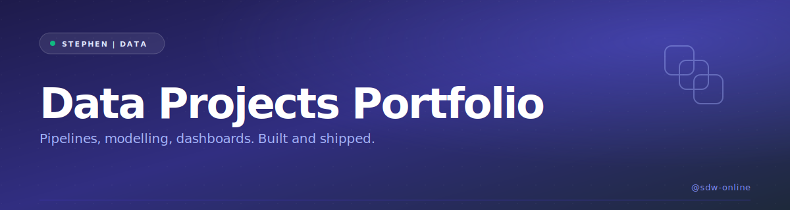

  

<i>Production-grade data project walkthroughs. Pipelines, modelling, dashboards. Built and shipped.</i>

<b>41 project shorts</b> &nbsp;·&nbsp; <b>45.2K total views</b> &nbsp;·&nbsp; full-length builds below &nbsp;·&nbsp; <a href="https://www.youtube.com/@sdw-online?sub_confirmation=1">subscribe</a>

  

<!-- TODO(stephen): Notion URL - wrap the img above in an anchor tag once the product page is ready -->

## What's inside

Full-length project builds at the top - the substantive walkthroughs that show how the work actually gets done. Shorts catalogue below - bite-size demonstrations of the same skills. Pair them however you learn best.

## Full-length builds

Deep walkthroughs - end-to-end project tutorials.

> Coming soon.

<!-- TODO(stephen): full-length video IDs - pass them via --full-length=id1,id2,... when regenerating -->

## Shorts catalogue

41 data project shorts, sorted by what landed hardest.

<table>
<tr>
<td align="center" width="33%">
   
  <b>Data project: Azure data lake to Databricks (Spark) - A simple data engineering...</b> 5.3K views
</td>
<td align="center" width="33%">
   
  <b>REST API to SQL database: data project you can finish this weekend</b> 2.3K views
</td>
<td align="center" width="33%">
   
  <b>Data project: SQL Server to Postgres (with Matplotlib) - use Python + SQL to...</b> 2.2K views
</td>
</tr>
<tr>
<td align="center" width="33%">
   
  <b>REST API to SQL (with Python) data project is NOW on YouTube! YouTube: Stephen | Data</b> 2.1K views
</td>
<td align="center" width="33%">
   
  <b>Try this simple data engineering project: AWS to Snowflake (via Python)</b> 2.1K views
</td>
<td align="center" width="33%">
   
  <b>Select one of these 7 FREE IDEs for coding your data projects: 1</b> 2K views
</td>
</tr>
<tr>
<td align="center" width="33%">
   
  <b>EVERY data project I've released online - just for YOU (check link in bio to see...</b> 1.9K views
</td>
<td align="center" width="33%">
   
  <b>5 FREE websites with datasets for your data projects: 1</b> 1.7K views
</td>
<td align="center" width="33%">
   
  <b>Use financial data from publicly traded US companies (via the SEC's EDGAR database)...</b> 1.4K views
</td>
</tr>
<tr>
<td align="center" width="33%">
   
  <b>Add this data engineering project to your portfolio (SQL to AWS S3 using Python)</b> 1.4K views
</td>
<td align="center" width="33%">
   
  <b>Try this web scraping project if you want to learn how to move data into AWS S3</b> 1.4K views
</td>
<td align="center" width="33%">
   
  <b>Data project: AWS to Snowflake 1</b> 1.4K views
</td>
</tr>
<tr>
<td align="center" width="33%">
   
  <b>Data project using a free API, Airflow and Python</b> 1.2K views
</td>
<td align="center" width="33%">
   
  <b>Data project: web scraping and data visualization with Python</b> 1.1K views
</td>
<td align="center" width="33%">
   
  <b>Here's another data project to add to your portfolio (REST API to SQL database)</b> 1.1K views
</td>
</tr>
<tr>
<td align="center" width="33%">
   
  <b>Project idea: REST API to Azure SQL DB (with Azure Data Factory)</b> 1.1K views
</td>
<td align="center" width="33%">
   
  <b>Here's an end-to-end Excel data project that includes XLOOKUPS and INDEX MATCHES by...</b> 1K views
</td>
<td align="center" width="33%">
   
  <b>Automate data workflows using Python, Airflow and AWS with this data project</b> 986 views
</td>
</tr>
<tr>
<td align="center" width="33%">
   
  <b>SQL to AWS S3 (with Python): data project you can finish this weekend</b> 985 views
</td>
<td align="center" width="33%">
   
  <b>Flat file to SQL (via Excel's Power Query): data project you can finish in a day</b> 980 views
</td>
<td align="center" width="33%">
   
  <b>Here's another data engineering project you can play around with: AWS S3 to...</b> 960 views
</td>
</tr>
<tr>
<td align="center" width="33%">
   
  <b>What do you want to see on YouTube next? SQL? Python? Data project? The choice is...</b> 883 views
</td>
<td align="center" width="33%">
   
  <b>Excel to Power BI: data project you can finish this weekend</b> 791 views
</td>
<td align="center" width="33%">
   
  <b>Data project: Excel to Python</b> 731 views
</td>
</tr>
<tr>
<td align="center" width="33%">
   
  <b>Try this data project using SQL + Looker Studio to visualize a pizza restaurant's...</b> 723 views
</td>
<td align="center" width="33%">
   
  <b>Use REST APIs (Representational State Transfer) to facilitate communication between...</b> 687 views
</td>
<td align="center" width="33%">
   
  <b>5 APIs the top 1% use for their data portfolios: 1</b> 663 views
</td>
</tr>
<tr>
<td align="center" width="33%">
   
  <b>Check my GitHub if you're looking for end-to-end data projects to get ideas from</b> 661 views
</td>
<td align="center" width="33%">
   
  <b>Here's my response to "where to find an end-to-end data project that shows how to...</b> 621 views
</td>
<td align="center" width="33%">
   
  <b>If you're not sure where to find datasets for your data projects, try these ones...</b> 608 views
</td>
</tr>
<tr>
<td align="center" width="33%">
   
  <b>Use this website to access over 130,000 free datasets for your data projects</b> 599 views
</td>
<td align="center" width="33%">
   
  <b>5 places to find real datasets the top 1% use for their portfolios: 1</b> 589 views
</td>
<td align="center" width="33%">
   
  <b>5 data projects on YouTube you should watch: 1</b> 582 views
</td>
</tr>
<tr>
<td align="center" width="33%">
   
  <b>Find medical datasets for your data projects from these websites</b> 513 views
</td>
<td align="center" width="33%">
   
  <b>What data project do you want to see me create a step-by-step YouTube tutorial on...</b> 409 views
</td>
<td align="center" width="33%">
   
  <b>Use these data validation checks for your data projects: 1</b> 380 views
</td>
</tr>
<tr>
<td align="center" width="33%">
   
  <b>If you're looking for an end-to-end data project showing you each step of the...</b> 353 views
</td>
<td align="center" width="33%">
   
  <b>Data projects to try this weekend: 1</b> 318 views
</td>
<td align="center" width="33%">
   
  <b>Here's how to create a face recognition program using Python as a data project with...</b> 249 views
</td>
</tr>
<tr>
<td align="center" width="33%">
   
  <b>Data projects to attract prospect employers and recruiters is not the only reason...</b> 171 views
</td>
<td align="center" width="33%">
   
  <b>Data projects to try this weekend: 1</b> 93 views
</td>
</tr>
</table>

  

<!-- TODO(stephen): Notion URL - wrap the img above in an anchor tag once the product page is ready -->

## More from Stephen | Data

- **[30 Day SQL Challenge](https://github.com/sdw-online/30-Day-SQL-Challenge)** &nbsp;·&nbsp; structured month of SQL
- **[30 Day Excel Challenge](https://github.com/sdw-online/30-Day-Excel-Challenge)** &nbsp;·&nbsp; structured month of Excel
- **[Data Shorts Library](https://github.com/sdw-online/Data-Shorts-Library)** &nbsp;·&nbsp; all 294 shorts, 11 categories, decision-tree nav
- **[YouTube channel](https://www.youtube.com/@sdw-online)** &nbsp;·&nbsp; the source for everything here

  

